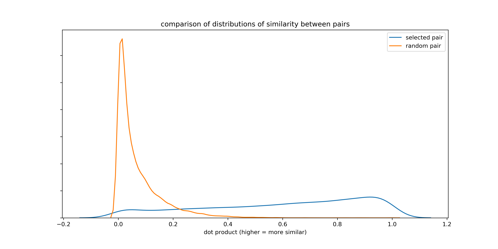
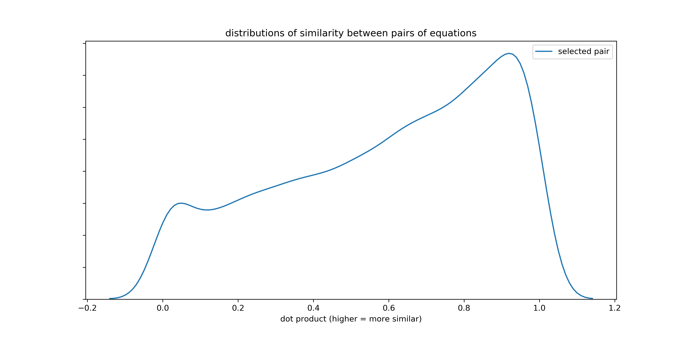

% Senior Project Report 
% Samuel Helms 
% Advised by John Lafferty

# Intro

## Motivation

Word and sentence embeddings are an incredibly powerful tool for natural language processing. Google Translate's error rate decreased by over 50\% when it switched to a model that used embeddings for translations [@noauthor_neural_nodate.

The options for telling how good embeddings are before running them through a downstream task like Google Translate are less amazing, however: Researchers only have a few small datasets, which are largely based on linguistic survey data, for this task [@schnabel_evaluation_2015].  

One of the reason so few datasets for evaluating embeddings exist are difficulties in determining when two words or sentences are different or similar. Consider how difficult it is for a machine learning model to determine that the phrase "the red-faced man" can be equivalent to "the embarrassed man" in the right context.

Mathematics is a type of language without this type of ambiguity about whether two clauses mean the same thing. The equals sign tells us with certainty when two expressions are equivalent to each other. Therefore mathematics is a perfect test bed for new embeddings models, since every mathematics text contains tens or hundreds of equivalencies with which to evaluate embeddings. 

As far as I am aware, no one has yet taken advantage of the equals sign for creating and evaluating embeddings. Throughout the course of this semester, I have created the first ever dataset of equivalent equations.

## Applications

This project will enable researchers and data scientists who work with mathematics texts to evaluate the intrinsic success of their embeddings. It may also enable better understanding of embedding in general. If I am able to create a large enough dataset of equivalent equations, the equivalent equations could also be used to train embeddings in a supervised fashion.

## Background
This fall, I started working with a research group that Prof. John Lafferty helped found called [The Hopper Project](https://github.com/hopper-project). The Hopper Project has created a dataset of academic articles from arxiv and coded up a pipeline that extracts LaTeX from these academic articles. I will extract equivalent equations from this dataset.

## Outcome: What I've Actually Created

### A dataset of equations related by things like equals signs

You can get a premade dataset of with 5 million equations in it at [https://github.com/samghelms/similar_eqs_senior_proj](https://github.com/samghelms/similar_eqs_senior_proj), in the `all_eqs` folder. This is a folder of files with processed equations. The repository includes examples on how to read in and work with these files, and instructions on how to generate your own dataset of interesting equation pairs.

These equations can be useful for a myriad of tasks, such as evaluating embeddings -- pairs split by relations should be equivalent in some sense -- or training embeddings models themselves. The final dataset has millions of equations, so the data can easily be used for such a task.

### A set of scripts for tokenizing TeX and identifying useful equations

If you're reading this report on github, you probably already know this. 

The repository at [https://github.com/samghelms/similar_eqs_senior_proj](https://github.com/samghelms/similar_eqs_senior_proj) contains the library of scripts and instructions on how to use them, as well as a premade pipeline for processing TeX formulas. Every function is unit tested and has been reworked many times based on feedback from Hopper Project researchers and mistakes made in processing jobs.

### A suite of tools for working with equation embeddings

Equations texts are harder to work with than normal english texts because they are written in LaTeX. I started working on a set of tools for visualizing mathematics in embeddings models this fall [@samghelms_mathviz:_2017]. 

This evolved into seeing how I contribute and work within existing tools. I've since come up with ways of rendering rich html/javascript representations of math in jupyter notebooks, and I have made a gist showing how to do so available to the public: [https://github.com/samghelms/similar_eqs_senior_proj](https://gist.github.com/samghelms/d1bd0a941c29044d6baa213ad96daa67).

I also got interested in being able to visualize math on T-SNE plots (for the uninitiated: a 2d scatter plot that approximates high dimensional vectors). I'm currently developing a fully fledged library that allows you to easily create such plots, and you can see my prototype in action here: [https://samghelms.github.io/webgl-scatter/](https://samghelms.github.io/webgl-scatter/) (zoom in and hover!).

# The Code

In this section, I will go over the code I have written to tokenize TeX equations at a high level and explain why I wrote it the way I did. Note that this is only a high level discussion: look to the readme and comments in the code base for specific instructions on how to use the pipeline. Before I jump into the specifics of the code, I will give a brief background on TeX to make it clearer why I had to go to the lengths I did to get aligned few math equations. 

Identifying and using equal equations in machine learning models requires two things: One, being able to properly identify tokens (so that the LaTeX code `\\int` is treated as an atomic unit and not a sequence of the characters "\\", "i", "n", and "t"); Two, being able to say whether a subexpression is substantive enough to use in the model. 

You could determine substantiveness (the second requirement) by doing things like setting a string length cutoff for the subexpression and taking tf-idf scores between two expressions on either side of an equals, but this provides no guarantee of substantiveness--the expression `x + y` is arguably just as substantive as `\\frac { x_7 } { y_i }`, with one operator and two variables, but it would be hard to determine so based on tf-idf score or the length of the expression.

As a result of this difficulty in determining substantiveness, I decided to implement a heuristic function that would make a shallow parse of the TeX expression and determine if it contained at least one operator and two variables and/or numbers at a high level. I arbitrarily decided on this cutoff for the number of variables and expressions, and wrote the code so this could be adjusted. By "high level" I mean not within a subexpression or exponent, or a function argument--so f(x + y) would not count as a substantive expression.

## A brief history of TeX

You might be wondering why tokenization and parsing  similar equations was hard enough a task to spend a whole semester doing it. You would be right to wonder: it should not be very hard to do, if not for the fact that the core layout algorithms for TeX are all written in a virtually extinct language called [WEB](https://en.wikipedia.org/wiki/WEB) written by the creator of TeX, Donald Knuth, himself. 

Because WEB has been all but forgotten, the core TeX algorithms implemented in it by Knuth are automatically cross-compiled into C code before being used by TeX tools like texlive. This makes it extremely difficult to hack into TeX's parsing algorithms and access their internal data structures. Without access to the TeX algorithms or internal data structures (or even source code that is easy to navigate and/or understand), it is hard to even tokenize LaTeX codes, not to mention parse them.

As a result, I have written my own tokenization function. I have not written a complete TeX parser, but I have implemented a shallow parse that can skip along the highest level of TeX code and check if it contains certain types of operations.

A group at Harvard wrote a wrapper around KaTeX for tokenizing LaTeX math expressions. I decided to write my own so that I could be absolutely certain about the assumptions underlying the data and avoid accidentally introducing bias into the data.

## Tokenization

I implemented a finite state machine to tokenize TeX codes. It takes a stream of characters from an equation from an arxiv text as input and iterates over it, changing state with each new character. Depending on the state and the character, the FSM will build a token or create a new one. 

The following input string will be tokenized to the following list by the function `tokenize` in `tok.py`:

`'\\frac{x} {y} \\begin{eq }x = \\textfadfsad{tets} \\int 1.0 .6 \\end{test}'` 

`['\\frac', '{', 'x', '}', '{', 'y', '}', '\\begin', '{', 'e', 'q', '}', 'x', '=', '\\text', 'fadfsad', '{', 't', 'e', 't', 's', '}', '\\int', '1.0', '.6', '\\end', '{', 't', 'e', 's', 't', '}']`

On the first pass, the tokenizer follows some extremely simple rules, like building every character a-z that comes after a \\ into a single token. This creates some incorrect tokens, like `\\intx`. So the tokenizer makes another pass along the now partially-tokenized expressions and attempts to break up any string starting with '\\' into a known macro. I acquired and merged two collections of known macros: 1 from CTAN (the official tex repository, you can check out the list in your browser at this link: [http://ctan.math.ca/tex-archive/info/symbols/comprehensive/SYMLIST](http://ctan.math.ca/tex-archive/info/symbols/comprehensive/SYMLIST)), and the other from KaTeX, Khan Academy's online math renderer. This function is called `fix_macros` and resides in `tok.py`

Example: 

`toks = tokenize('\\frac{x} {y} \\begin{eq }x = \\textfadfsad{tets} \\int 1.0 .6 \\end{test}')
fixed = fix_macros(toks, debug=True)
fixed == ['\\frac', '{', 'x', '}', '{', 'y', '}', '\\begin', '{', 'e', 'q', '}', 'x', '=', '\\text', 'fadfsad', '{', 't', 'e', 't', 's', '}', '\\int', '1.0', '.6', '\\end', '{', 't', 'e', 's', 't', '}']`

Location in codebase: `tok.py`. Tests in `test_tok.py`

You can run both of the commands together using the function `tokenize_and_fix_macros` in `tok.py`

## Further preparation

The following section goes over a series of functions I have written to further prepare the tokenized equations for a machine learning model. Keep in mind some, any, or all of these functions need not be used: You could modify them, write your own, or just use the output of the tokenization process for a model.

### Splitting

All code to do with splitting resides in `split.py`.

Splitting equations comes in two steps: 

1. Splitting equations that are in aligned environments, like the one below, into multiple expressions. These splits occur on:
* A "\\\\" (TeX for line break)
* A punction token (see all punctuation tokens in `data/punctuation_list.json`) that is not within a subexpression, A character is considered to be within a subexpression whenver it is within a two characters like "(" and ")" or "{" and "}". The full list of these characters comes from KaTeX's list of right and left bracket-type characters.
* A long inline text expression (long because we don't want to automatically split on something like `\\text{x}`) is encountered. 

Example of this first step:

One thing to note is that, if something like the following gets encountered, the bottom line gets "folded in" to the top one (this would be with a list of tokens in the code, I'm using TeX strings here for clarity).

`\begin{aligned} 
f(x) &= x + y^2 \\
     &= ax + b
\end{aligned}`

folding in =>

`f(x) = x + y^2 = ax + b`

The same rules apply to inline equations like `ax + b = 700x + z, ax + c = \theta + z`, which would be split into `ax + b = 700x + z` and `ax + c = \theta + z` (once again, these would actually be token lists in practice).

2. After expressions have been handled, equations are split on relations. I use a list of relations from KaTeX (`data/relation_list.json`) to find relations to split on. I only split when the relation is not within a left and right bracket-type character (like "{" and "}", see full list of right and left symbols in `open_list.json` and `close_list.json`). 

Example (stylized for clarity):

`f(x) + y = 100x^2` => `f(x) + y` and `100x^2`

(Actual example from the code)

`split(tokenize_and_fix_macros("5 = 6 \\\\ = 6 + 7"))`

Results in the following pairs:

`[[['5'], ['6'], ['6', '+', '7']]]`

Location in codebase: `split.py`. Tests in `test_split.py`

### Heuristics for finding useful pairs

Once we have tokenized and split our equations, we need to determine which of these expression pairs are worth keeping. One way to do this would be to just use a term-frequency-inverse-document-frequency (tf-idf) similarity score for each equation pair, setting some arbitrary cutoff.

#### TF-IDF
If you want to use tf-idf scores, you can with the data in `all_eqs` -- just read in the 'tokenized_equation_filtered' field from the json objects, rather than the 'aligned' field.

#### Other metrics

I wanted to use the parsing abilities I have developed to develop another sort of metric. In `suitable.py`, I have implemented a test that checks if a math expression has more than one variables/symbol/number and at least one operator (something like a plus sign). I use this as the metric to create the dataset in `all_eqs`.

As an example, this test would return True for the following (tokenized) expression: 

`['x', '+', '1.0', '900', '\\theta', '\\int']`

But If you removed the '+', it would return false.

Additionally, it will only count operators if they are on the "inside" of the expression, so that things like the following list of tokens don't count.

`['+', '1.0', '900', '\\theta', '\\int']`

Location in codebase: `suitable.py`. Tests in `test_suitable.py`

### Stoplisting

There are some tokens that add nothing to the mathematical meaning of the expression, such as `\begin{align}`. In addition, comments inside of `\text` tags, though perhaps pertaining to the equation, end up distracting from the meanining as well, since, to the model, any character inside the `\text` looks like a variable.

Sometimes people do just use `\text` tags to make a variable look a certain way: I wanted to keep as many of these as possible, so I struck a balance where I only excluded `\text` tags and their children (anything within {} brackets) when there were more than 4 tokens within the brackets ({}).

Example: 

The following expression: 

`filter_tokens(['\\int', '\\text', '{', 'x', '}', '\\text', '{', 'h', 'i', 't', 'h', 'e', 'r', 'e', '}', 'x', '+', 'y'])`

Results in:

`['\\int', '\\text', '{', 'x', '}', 'x', '+', 'y']`

The first text tag is kept since it is relatively harmless, surrounding a variable to make it look differently. The second text tag surrounds a fully fledged expression, and thus gets pruned.

Location in codebase: `filter_equations.py`. Tests in `test_filter_equations.py`

### Normalization

LaTeX allows you to write expressions like `\int_{x+y}^5` and `\int^5_{x+y}` and get equivalent representations. `^` and any of its dependents always come before `_` and its dependents. I considered implementing a function to normalize these types of expressions, but thinking about the state of the art in NLP modeling made me decide against it. When we tokenize a natural lanuage sentence like "The man was buying groceries and walking a dog", we don't worry about the fact that it is equivalent to "The man was walking a dog and buying groceries". Not needing to worry about this makes the models more flexible, easier to train (fewer pre-processing steps), and generally better, in my opinion.

# Some metrics

| Total Number of Equations | Useful Equation pairs identified | 
|---------------------------|----------------------------------| 
| 69,052,499                | 1,881,786                        | 

## TF-IDF similarity between identified pairs of equations versus random pairs

One way to evaluate how useful this process of splitting on relations is by checking the term-frequency-inverse-document-frequency similarity scores between the pairs of equations, and comparing these scores with randomly assigned pairs of equations. We would expect that equations identified via equivalencies would have a pretty high similarity to each other, on average, since people tend to repeat tokens on either side of a relation ($x + 6 = x + 3 + 3$, for example).

The histogram at the beginning of the section compares the similiarity scores for the two across a sample of 100,000 equations. A higher score on the x axis means equations are more similar. 

You can see, based on this graph, that the probability of a pair of equations identified through the methodology laid out in this report being similar is much higher than that of a random pair.

It is a bit hard to see what the distribution of pairs identified through my methods is like since TF-IDF has such a higher peak. Plotted alone, the graph is more or less normally distributed. This is encouraging, since we would expect some sort of natural gradient to how similar equation are, and yet also expect many to be very similar (but not *too* similar).

# Bibliography

